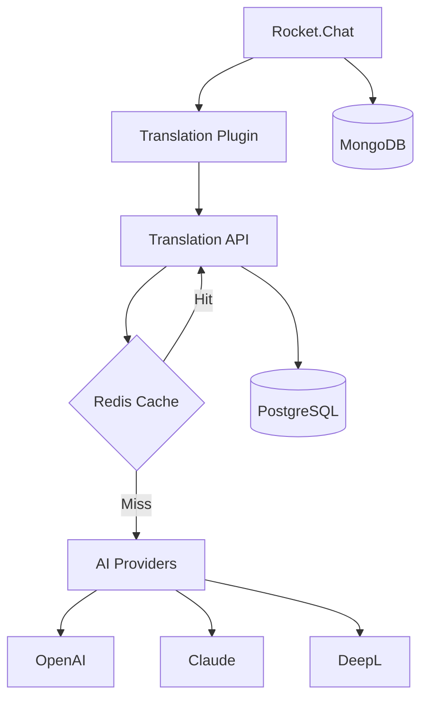

# Developer Guide

## 🚀 Getting Started

### Prerequisites

1. Install required tools:
   ```bash
   # macOS
   brew install node docker git

   # Verify installations
   node --version  # Should be 18+
   docker --version  # Should be 4.0+
   ```

2. Clone and setup:
   ```bash
   git clone https://github.com/paysera/rocket-chat-universal-translator.git
   cd rocket-chat-universal-translator
   npm install
   ```

## 🏗️ Architecture Overview

### System Components



### Data Flow

1. User sends message in Rocket.Chat
2. Plugin intercepts message
3. Plugin calls Translation API
4. API checks Redis cache
5. If cache miss, calls AI provider
6. Stores translation in PostgreSQL
7. Returns translated message
8. Plugin displays translation

### Technology Stack

- **Backend**: Node.js + TypeScript + Express
- **Database**: PostgreSQL (translations) + MongoDB (Rocket.Chat)
- **Cache**: Redis
- **AI Providers**: OpenAI, Anthropic Claude, DeepL, Google Translate
- **Plugin**: Rocket.Chat Apps Framework
- **Infrastructure**: Docker, Docker Compose
- **Monitoring**: Prometheus metrics, Health checks

## 💻 Development Workflow

### 1. Environment Setup

```bash
# Clone repository
git clone https://github.com/paysera/rocket-chat-universal-translator.git
cd rocket-chat-universal-translator

# Install dependencies for all packages
npm run install:all

# Copy environment files
cp .env.example .env

# Configure API keys in .env
vim .env  # Add your API keys
```

### 2. Development Mode

```bash
# Start all services with Docker
docker-compose -f docker-compose.dev.yml up -d

# Start API in development mode (hot reload)
cd api && npm run dev

# In another terminal, start plugin development
cd plugin && npm run dev

# View logs
docker-compose -f docker-compose.dev.yml logs -f
```

### 3. Feature Development Workflow

```bash
# Create feature branch
git checkout -b feature/your-feature-name

# Make changes and test
npm test
npm run lint
npm run typecheck

# Commit changes
git add .
git commit -m "feat: add new translation feature"

# Push and create PR
git push origin feature/your-feature-name
```

## 📁 Project Structure Deep Dive

```
rocket-chat-universal-translator/
├── api/                          # Translation API Service
│   ├── src/
│   │   ├── routes/               # Express route handlers
│   │   │   ├── translate.ts      # Translation endpoints
│   │   │   ├── health.ts         # Health check endpoints
│   │   │   ├── preferences.ts    # User preferences
│   │   │   └── translation.ts    # Translation management
│   │   ├── services/             # Business logic layer
│   │   │   ├── TranslationService.ts
│   │   │   ├── CacheService.ts
│   │   │   └── ProviderRouter.ts
│   │   ├── providers/            # AI provider integrations
│   │   │   ├── base.ts           # Base provider interface
│   │   │   ├── OpenAIProvider.ts
│   │   │   ├── ClaudeProvider.ts
│   │   │   └── DeepLProvider.ts
│   │   ├── middleware/           # Express middleware
│   │   │   ├── auth.ts           # Authentication
│   │   │   ├── rateLimiter.ts    # Rate limiting
│   │   │   └── errorHandler.ts   # Error handling
│   │   ├── config/               # Configuration
│   │   │   ├── database.ts       # PostgreSQL config
│   │   │   ├── redis.ts          # Redis config
│   │   │   └── env-validator.ts  # Environment validation
│   │   └── utils/                # Utility functions
│   ├── tests/                    # API tests
│   ├── Dockerfile                # API container definition
│   └── package.json
├── plugin/                       # Rocket.Chat Plugin
│   ├── src/
│   │   ├── handlers/             # Event handlers
│   │   │   ├── MessageHandler.ts
│   │   │   └── SettingsHandler.ts
│   │   ├── services/             # Plugin services
│   │   ├── ui/                   # UI components
│   │   └── lib/                  # Helper libraries
│   ├── tests/                    # Plugin tests
│   └── app.json                  # Plugin manifest
├── shared/                       # Shared code
│   ├── types/                    # TypeScript type definitions
│   └── utils/                    # Common utilities
├── scripts/                      # Development scripts
│   ├── setup.sh
│   ├── test.sh
│   └── deploy.sh
├── docs/                         # Documentation
└── docker-compose.*.yml          # Docker configurations
```

## 🧪 Testing Strategy

### Unit Tests

```typescript
// api/tests/unit/translator.test.ts
import { TranslationService } from '../../src/services/TranslationService';

describe('TranslationService', () => {
  let service: TranslationService;

  beforeEach(() => {
    service = new TranslationService();
  });

  it('should translate text correctly', async () => {
    const result = await service.translate({
      text: 'Hello',
      targetLang: 'lt',
      provider: 'openai'
    });

    expect(result.translatedText).toBe('Labas');
    expect(result.confidence).toBeGreaterThan(0.8);
  });

  it('should handle translation errors gracefully', async () => {
    // Test error handling
    await expect(service.translate({
      text: '',
      targetLang: 'invalid'
    })).rejects.toThrow('Invalid language code');
  });
});
```

### Integration Tests

```typescript
// api/tests/integration/api.test.ts
import request from 'supertest';
import { app } from '../../src/server';

describe('Translation API Integration', () => {
  it('should handle translation request end-to-end', async () => {
    const response = await request(app)
      .post('/api/translate')
      .send({
        text: 'Hello world',
        targetLang: 'lt',
        provider: 'openai'
      })
      .expect(200);

    expect(response.body).toHaveProperty('translatedText');
    expect(response.body).toHaveProperty('confidence');
    expect(response.body.targetLang).toBe('lt');
  });

  it('should validate input parameters', async () => {
    await request(app)
      .post('/api/translate')
      .send({
        text: '',  // Invalid empty text
        targetLang: 'lt'
      })
      .expect(400);
  });
});
```

### E2E Tests

```typescript
// tests/e2e/translation-flow.test.ts
import { Browser, Page } from 'playwright';
import { chromium } from 'playwright';

describe('End-to-End Translation Flow', () => {
  let browser: Browser;
  let page: Page;

  beforeAll(async () => {
    browser = await chromium.launch();
    page = await browser.newPage();
  });

  afterAll(async () => {
    await browser.close();
  });

  it('should translate message in Rocket.Chat', async () => {
    // Login to Rocket.Chat
    await page.goto('http://192.168.110.199:3013');
    await page.fill('[name="emailOrUsername"]', 'admin');
    await page.fill('[name="pass"]', 'admin123');
    await page.click('[data-qa="login-button"]');

    // Send a message
    await page.fill('[name="msg"]', 'Hello world');
    await page.press('[name="msg"]', 'Enter');

    // Wait for translation to appear
    await page.waitForSelector('[data-testid="translated-message"]');

    const translatedText = await page.textContent('[data-testid="translated-message"]');
    expect(translatedText).toBeTruthy();
  });
});
```

### Test Commands

```bash
# Run all tests
npm test

# Run specific test types
npm run test:unit
npm run test:integration
npm run test:e2e

# Run tests with coverage
npm run test:coverage

# Run tests in watch mode
npm run test:watch

# Run performance tests
npm run test:performance

# Run security tests
npm run test:security
```

## 🐛 Debugging

### Development Debug Setup

```bash
# Enable debug logging
export DEBUG=translator:*
export LOG_LEVEL=debug

# Start services with debug mode
npm run dev:debug

# Debug specific components
export DEBUG=translator:providers:*
export DEBUG=translator:cache:*
export DEBUG=translator:auth:*
```

### VS Code Debug Configuration

`.vscode/launch.json`:
```json
{
  "version": "0.2.0",
  "configurations": [
    {
      "type": "node",
      "request": "launch",
      "name": "Debug API",
      "runtimeExecutable": "npm",
      "runtimeArgs": ["run", "dev"],
      "cwd": "${workspaceFolder}/api",
      "console": "integratedTerminal",
      "envFile": "${workspaceFolder}/.env"
    },
    {
      "type": "node",
      "request": "launch",
      "name": "Debug Tests",
      "runtimeExecutable": "npm",
      "runtimeArgs": ["test", "--", "--inspect-brk"],
      "cwd": "${workspaceFolder}/api",
      "console": "integratedTerminal"
    }
  ]
}
```

### Common Debug Scenarios

#### Provider API Errors
```bash
# Test OpenAI connectivity
curl -H "Authorization: Bearer $OPENAI_API_KEY" \
     -H "Content-Type: application/json" \
     -d '{"model":"gpt-3.5-turbo","messages":[{"role":"user","content":"test"}]}' \
     https://api.openai.com/v1/chat/completions

# Test Claude connectivity
curl -H "x-api-key: $ANTHROPIC_API_KEY" \
     -H "Content-Type: application/json" \
     -d '{"model":"claude-3-sonnet-20240229","max_tokens":100,"messages":[{"role":"user","content":"test"}]}' \
     https://api.anthropic.com/v1/messages
```

#### Database Connection Issues
```bash
# Test PostgreSQL connection
docker exec -it translator-postgres-dev psql -U translator -d translator

# Check database tables
\dt

# Check recent translations
SELECT * FROM translations ORDER BY created_at DESC LIMIT 10;
```

#### Redis Connection Issues
```bash
# Test Redis connection
docker exec -it translator-redis-dev redis-cli ping

# Check cache content
redis-cli
> KEYS translation:*
> GET translation:cache:key:example
```

#### Performance Debugging
```bash
# Monitor API performance
curl -w "@curl-format.txt" -o /dev/null -s http://192.168.110.199:3012/api/translate

# Check container resource usage
docker stats

# Monitor database performance
docker exec translator-postgres-dev psql -U translator -c "
SELECT query, calls, mean_exec_time, total_exec_time
FROM pg_stat_statements
ORDER BY mean_exec_time DESC
LIMIT 10;"
```

## 📦 Building and Deployment

### Local Build

```bash
# Build API
cd api
npm run build
# Output: api/dist/

# Build Plugin
cd plugin
npm run build
# Output: plugin/dist/

# Build all
npm run build
```

### Docker Build

```bash
# Development build
docker-compose -f docker-compose.dev.yml build

# Production build
docker-compose -f docker-compose.production.yml build

# Build specific service
docker-compose build translator-api
```

### Production Deployment

```bash
# Deploy to production
docker-compose -f docker-compose.production.yml up -d

# Rolling update
docker-compose -f docker-compose.production.yml pull
docker-compose -f docker-compose.production.yml up -d --no-deps translator-api

# Health check after deployment
curl -f https://translate-api.paysera.tech/healthz
```

## ⚙️ Configuration Management

### Environment Variables

```bash
# Development
NODE_ENV=development
DEBUG=translator:*
LOG_LEVEL=debug

# Database
DB_HOST=localhost
DB_PORT=5434
DB_NAME=translator
DB_USER=translator
DB_PASSWORD=translator123

# Redis
REDIS_HOST=localhost
REDIS_PORT=6381

# AI Providers
OPENAI_API_KEY=sk-...
ANTHROPIC_API_KEY=sk-ant-...
DEEPL_API_KEY=...
GOOGLE_TRANSLATE_API_KEY=...

# Security
JWT_SECRET=your-secret-key
ENCRYPTION_KEY=32-character-hex-key
INTERNAL_SECRET=internal-api-secret

# Rocket.Chat
ROCKETCHAT_URL=http://192.168.110.199:3013
ROCKETCHAT_ADMIN_USER=admin
ROCKETCHAT_ADMIN_PASS=admin123
```

### Provider Configuration

`config/providers.json`:
```json
{
  "providers": {
    "openai": {
      "enabled": true,
      "model": "gpt-4o-mini",
      "maxTokens": 2000,
      "temperature": 0.1,
      "rateLimit": {
        "requestsPerMinute": 60,
        "requestsPerDay": 1000
      }
    },
    "anthropic": {
      "enabled": true,
      "model": "claude-3-sonnet-20240229",
      "maxTokens": 2000,
      "rateLimit": {
        "requestsPerMinute": 50,
        "requestsPerDay": 800
      }
    },
    "deepl": {
      "enabled": true,
      "formality": "default",
      "rateLimit": {
        "requestsPerMinute": 30
      }
    }
  },
  "routing": {
    "defaultProvider": "openai",
    "fallbackOrder": ["openai", "anthropic", "deepl"],
    "languageSpecific": {
      "de": "deepl",
      "fr": "deepl",
      "es": "deepl"
    }
  }
}
```

## 🔧 Development Tools

### Code Quality

```bash
# Linting
npm run lint
npm run lint:fix

# Type checking
npm run typecheck

# Formatting
npm run format
npm run format:check

# Pre-commit hooks
npm run setup:ci
```

### Performance Monitoring

```bash
# Performance profiling
npm run profile

# Memory usage analysis
npm run analyze:memory

# Bundle size analysis
npm run analyze:bundle
```

### Database Management

```bash
# Run migrations
npm run migrate

# Seed development data
npm run seed

# Database backup
npm run backup

# Database restore
npm run restore backup-file.sql
```

## 📚 API Development Patterns

### Controller Pattern

```typescript
// src/controllers/TranslationController.ts
export class TranslationController {
  constructor(
    private translationService: TranslationService,
    private logger: Logger
  ) {}

  async translate(req: AuthRequest, res: Response): Promise<void> {
    try {
      // 1. Validate input
      const validationErrors = validationResult(req);
      if (!validationErrors.isEmpty()) {
        res.status(400).json({ errors: validationErrors.array() });
        return;
      }

      // 2. Extract parameters
      const { text, targetLang, provider } = req.body;

      // 3. Call service
      const result = await this.translationService.translate({
        text,
        targetLang,
        provider,
        userId: req.user?.id
      });

      // 4. Return response
      res.json(result);
    } catch (error) {
      this.logger.error('Translation failed', { error, body: req.body });
      res.status(500).json({ error: 'Translation failed' });
    }
  }
}
```

### Service Pattern

```typescript
// src/services/TranslationService.ts
export class TranslationService {
  constructor(
    private providerRouter: ProviderRouter,
    private cacheService: CacheService,
    private repository: TranslationRepository
  ) {}

  async translate(request: TranslationRequest): Promise<TranslationResponse> {
    // 1. Check cache
    const cacheKey = this.generateCacheKey(request);
    const cached = await this.cacheService.get(cacheKey);
    if (cached) {
      return { ...cached, cached: true };
    }

    // 2. Route to appropriate provider
    const provider = await this.providerRouter.selectProvider(request);

    // 3. Perform translation
    const result = await provider.translate(request);

    // 4. Store in cache and database
    await Promise.all([
      this.cacheService.set(cacheKey, result, 3600),
      this.repository.save(request, result)
    ]);

    return { ...result, cached: false };
  }
}
```

### Provider Pattern

```typescript
// src/providers/OpenAIProvider.ts
export class OpenAIProvider extends BaseProvider {
  async translate(request: TranslationRequest): Promise<ProviderResponse> {
    const prompt = this.buildPrompt(request);

    const response = await this.openai.chat.completions.create({
      model: this.config.model,
      messages: [{ role: 'user', content: prompt }],
      temperature: 0.1,
      max_tokens: this.config.maxTokens
    });

    return this.parseResponse(response, request);
  }

  private buildPrompt(request: TranslationRequest): string {
    return `Translate the following text from ${request.sourceLang || 'auto-detect'} to ${request.targetLang}:

Text: "${request.text}"

Context: ${request.context?.join('\n') || 'None'}

Requirements:
- Maintain context and meaning
- Use appropriate formality level
- Return only the translated text`;
  }
}
```

## 🤝 Contributing Guidelines

### Code Style

- Use TypeScript for all new code
- Follow ESLint configuration
- Use Prettier for formatting
- Write JSDoc comments for public APIs
- Use meaningful variable and function names

### Git Workflow

```bash
# Feature development
git checkout develop
git pull origin develop
git checkout -b feature/your-feature

# Development work
# ... make changes ...

# Commit with conventional commits
git commit -m "feat: add new translation provider"
git commit -m "fix: handle rate limit errors"
git commit -m "docs: update API documentation"

# Push and create PR
git push origin feature/your-feature
```

### Pull Request Process

1. Create feature branch from `develop`
2. Implement changes with tests
3. Update documentation
4. Ensure all checks pass
5. Request review from team
6. Address feedback
7. Merge to `develop`

### Testing Requirements

- Unit tests for all services and utilities
- Integration tests for API endpoints
- E2E tests for critical user flows
- Minimum 80% code coverage
- All tests must pass before merge

## 📞 Getting Help

### Resources

- **Documentation**: [README.md](README.md), [API Docs](api/swagger.yml)
- **Troubleshooting**: [TROUBLESHOOTING.md](TROUBLESHOOTING.md)
- **Architecture**: [docs/architecture.md](docs/architecture.md)
- **Deployment**: [DEPLOYMENT.md](DEPLOYMENT.md)

### Communication Channels

- **Slack**: #translator-dev for development discussions
- **Issues**: GitHub Issues for bug reports and feature requests
- **Email**: dev-team@paysera.com for urgent matters
- **Wiki**: Internal documentation and guides

### Code Review Guidelines

- Review within 24 hours
- Focus on functionality, security, and maintainability
- Provide constructive feedback
- Approve when ready or request specific changes
- Use GitHub review features for discussions