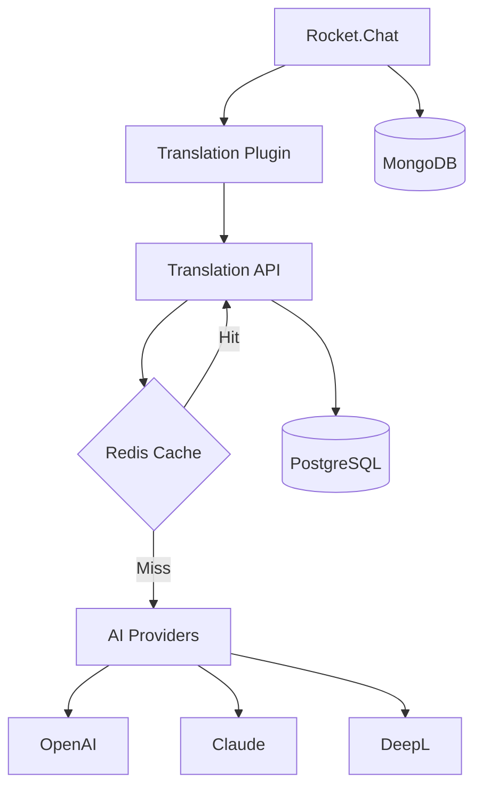

# UŽDUOTIS #007: Dokumentacijos atnaujinimas ir sutvarkymas

## 🟢 PRIORITETAS: VIDUTINIS
**Terminas**: 2-3 dienos
**Laikas**: ~3-4 valandos
**Blokuoja**: Developer onboarding, maintenance

## 📋 Problema

Dokumentacija neatitinka realybės:
- README.md outdated su senais portais
- API dokumentacija neegzistuoja
- Plugin development guide nebaigtas
- Deployment instrukcijos neteisingos
- Nėra troubleshooting guide

## 🎯 Kodėl tai svarbu?

1. **Developer Experience**: Nauji developers negali pradėti darbo
2. **Maintenance**: Be dokumentacijos sunku maintain'inti
3. **Knowledge Transfer**: Žinios prarandamos kai žmonės išeina
4. **Support**: Be docs support team negali padėti
5. **Compliance**: Paysera reikalauja technical documentation

## 🔧 Kaip taisyti

### Žingsnis 1: Atnaujinti README.md

```markdown
cat > README.md << 'EOF'
# 🌐 Universal Translator Pro for Rocket.Chat

Automatinė real-time vertimo sistema Rocket.Chat platformai su AI-powered vertimo galimybėmis.

## 📋 Turinys

- [Apžvalga](#apžvalga)
- [Architektūra](#architektūra)
- [Funkcionalumas](#funkcionalumas)
- [Reikalavimai](#reikalavimai)
- [Įdiegimas](#įdiegimas)
- [Konfigūracija](#konfigūracija)
- [Development](#development)
- [Testing](#testing)
- [Deployment](#deployment)
- [API Dokumentacija](#api-dokumentacija)
- [Troubleshooting](#troubleshooting)

## 🎯 Apžvalga

Universal Translator Pro integruoja su Rocket.Chat ir automatiškai verčia pranešimus real-time naudojant:
- OpenAI GPT-4
- Anthropic Claude
- Google Translate
- DeepL

### Pagrindinės funkcijos

✅ **Real-time vertimas** - Automatinis pranešimų vertimas
✅ **Kalbos aptikimas** - Automatiškai nustato šaltinio kalbą
✅ **Multi-provider** - Kelių AI tiekėjų palaikymas
✅ **Kontekstinis vertimas** - Išlaiko pokalbio kontekstą
✅ **Offline cache** - Redis cache greitam vertimui

## 🏗️ Architektūra

```
┌─────────────────┐     ┌──────────────┐     ┌─────────────┐
│  Rocket.Chat    │────▶│ Translation  │────▶│ AI Providers│
│   (Plugin)      │◀────│     API      │◀────│  (OpenAI,   │
└─────────────────┘     └──────────────┘     │   Claude)   │
        │                      │              └─────────────┘
        │                      │
        ▼                      ▼
┌─────────────────┐     ┌──────────────┐
│    MongoDB      │     │  PostgreSQL  │
│  (Chat data)    │     │ (Translations)│
└─────────────────┘     └──────────────┘
                               │
                               ▼
                        ┌──────────────┐
                        │    Redis     │
                        │   (Cache)    │
                        └──────────────┘
```

## 🛠️ Reikalavimai

### Sistema
- Docker Desktop 4.0+
- Node.js 18+ (development)
- 8GB RAM minimum
- 20GB disk space

### Portai
- 3012: Translation API (dev)
- 3013: Rocket.Chat (dev)
- 8015: Production API
- 5433: PostgreSQL
- 6380: Redis
- 27017: MongoDB

## 📦 Įdiegimas

### Quick Start (Docker)

```bash
# Clone repository
git clone https://github.com/paysera/rocket-chat-universal-translator.git
cd rocket-chat-universal-translator

# Copy environment template
cp .env.example .env.dev

# Add your API keys to .env.dev
# OPENAI_API_KEY=sk-...
# ANTHROPIC_API_KEY=sk-ant-...

# Start all services
docker-compose -f docker-compose.dev.yml up -d

# Check status
docker-compose -f docker-compose.dev.yml ps

# View logs
docker-compose -f docker-compose.dev.yml logs -f
```

### Access Points

- **Rocket.Chat**: http://192.168.110.199:3013
  - Username: admin
  - Password: admin123

- **API Health**: http://192.168.110.199:3012/healthz
- **API Docs**: http://192.168.110.199:3012/api-docs

## ⚙️ Konfigūracija

### Environment Variables

| Variable | Description | Required | Default |
|----------|-------------|----------|---------|
| `NODE_ENV` | Environment (development/production) | Yes | development |
| `PORT` | API server port | Yes | 3001 |
| `DB_HOST` | PostgreSQL host | Yes | postgres |
| `DB_PORT` | PostgreSQL port | Yes | 5432 |
| `DB_NAME` | Database name | Yes | translator |
| `DB_USER` | Database user | Yes | translator |
| `DB_PASSWORD` | Database password | Yes | - |
| `REDIS_HOST` | Redis host | Yes | redis |
| `REDIS_PORT` | Redis port | Yes | 6379 |
| `OPENAI_API_KEY` | OpenAI API key | No | - |
| `ANTHROPIC_API_KEY` | Anthropic API key | No | - |
| `DEEPL_API_KEY` | DeepL API key | No | - |
| `GOOGLE_TRANSLATE_API_KEY` | Google Translate key | No | - |

### Provider Configuration

Edit `config/providers.json`:

```json
{
  "providers": {
    "openai": {
      "enabled": true,
      "model": "gpt-4",
      "maxTokens": 2000
    },
    "anthropic": {
      "enabled": true,
      "model": "claude-3-opus",
      "maxTokens": 2000
    }
  }
}
```

## 💻 Development

### Local Development Setup

```bash
# Install dependencies
npm install

# Start development services
npm run dev:services

# Start API in watch mode
cd api && npm run dev

# In another terminal, start plugin development
cd plugin && npm run dev

# Run tests
npm test

# Lint code
npm run lint

# Type check
npm run typecheck
```

### Project Structure

```
rocket-chat-universal-translator/
├── api/                  # Translation API backend
│   ├── src/
│   │   ├── controllers/  # Request handlers
│   │   ├── services/     # Business logic
│   │   ├── providers/    # AI provider integrations
│   │   ├── middleware/   # Express middleware
│   │   └── database/     # Database models
│   └── tests/            # API tests
├── plugin/               # Rocket.Chat plugin
│   ├── src/
│   │   ├── handlers/     # Message handlers
│   │   ├── settings/     # Plugin settings
│   │   └── lib/          # Helper functions
│   └── tests/            # Plugin tests
├── shared/               # Shared types and utilities
├── docker/               # Docker configurations
├── scripts/              # Utility scripts
└── docs/                 # Documentation
```

## 🧪 Testing

### Run All Tests

```bash
# Unit tests
npm test

# Integration tests
npm run test:integration

# E2E tests
npm run test:e2e

# Coverage report
npm run test:coverage
```

### Test Specific Component

```bash
# Test API only
cd api && npm test

# Test plugin only
cd plugin && npm test

# Test with watch mode
npm run test:watch
```

## 🚀 Deployment

### Production Deployment

```bash
# Build production images
docker-compose -f docker-compose.production.yml build

# Deploy to production
docker-compose -f docker-compose.production.yml up -d

# Check production health
curl https://translate-api.paysera.tech/healthz
```

### CI/CD Pipeline

GitHub Actions automatically:
1. Runs tests on PR
2. Builds Docker images
3. Deploys to staging on merge to develop
4. Deploys to production on merge to main

## 📚 API Dokumentacija

### Endpoints

#### POST /api/translate
Translate text between languages.

**Request:**
```json
{
  "text": "Hello world",
  "sourceLang": "en",
  "targetLang": "lt",
  "provider": "openai"
}
```

**Response:**
```json
{
  "translatedText": "Labas pasauli",
  "sourceLang": "en",
  "targetLang": "lt",
  "confidence": 0.95,
  "provider": "openai"
}
```

#### POST /api/detect-language
Detect language of text.

**Request:**
```json
{
  "text": "Bonjour le monde"
}
```

**Response:**
```json
{
  "language": "fr",
  "confidence": 0.98
}
```

#### GET /api/languages
Get supported languages.

**Response:**
```json
{
  "languages": [
    {"code": "en", "name": "English"},
    {"code": "lt", "name": "Lithuanian"},
    {"code": "fr", "name": "French"}
  ]
}
```

### Rate Limiting

- 100 requests per minute per IP
- 1000 requests per hour per API key
- Bulk translations: 10 requests per minute

### Error Codes

| Code | Description |
|------|-------------|
| 400 | Bad Request - Invalid parameters |
| 401 | Unauthorized - Invalid API key |
| 429 | Too Many Requests - Rate limit exceeded |
| 500 | Internal Server Error |
| 503 | Service Unavailable - Provider down |

## 🔧 Troubleshooting

### Common Issues

#### Services won't start
```bash
# Check port conflicts
lsof -i :3012
lsof -i :3013

# Stop conflicting services
docker-compose down
docker stop $(docker ps -aq)

# Restart with clean state
docker-compose -f docker-compose.dev.yml down -v
docker-compose -f docker-compose.dev.yml up -d
```

#### MongoDB replica set error
```bash
# Initialize replica set manually
docker exec -it translator-mongodb mongosh
> rs.initiate()
```

#### Translation not working
1. Check API keys in .env file
2. Verify provider is enabled in config
3. Check API logs: `docker logs translator-api`
4. Test API directly: `curl http://localhost:3012/healthz`

#### High memory usage
```bash
# Check container stats
docker stats

# Restart specific service
docker-compose -f docker-compose.dev.yml restart api

# Adjust memory limits in docker-compose
```

## 📞 Support

- **Documentation**: [Wiki](https://github.com/paysera/rocket-chat-universal-translator/wiki)
- **Issues**: [GitHub Issues](https://github.com/paysera/rocket-chat-universal-translator/issues)
- **Slack**: #translator-support
- **Email**: translator-support@paysera.com

## 📄 License

Copyright © 2024 Paysera. All rights reserved.
EOF
```

### Žingsnis 2: Sukurti API dokumentaciją (OpenAPI/Swagger)

```yaml
cat > api/swagger.yml << 'EOF'
openapi: 3.0.0
info:
  title: Universal Translator API
  version: 1.0.0
  description: AI-powered translation service for Rocket.Chat
  contact:
    name: API Support
    email: api-support@paysera.tech

servers:
  - url: http://192.168.110.199:3012
    description: Development server
  - url: https://translate-api.paysera.tech
    description: Production server

paths:
  /api/translate:
    post:
      summary: Translate text
      description: Translate text from source language to target language
      tags:
        - Translation
      requestBody:
        required: true
        content:
          application/json:
            schema:
              type: object
              required:
                - text
                - targetLang
              properties:
                text:
                  type: string
                  description: Text to translate
                  example: "Hello world"
                sourceLang:
                  type: string
                  description: Source language code (auto-detect if not provided)
                  example: "en"
                targetLang:
                  type: string
                  description: Target language code
                  example: "lt"
                provider:
                  type: string
                  enum: [openai, anthropic, deepl, google]
                  description: Translation provider
                  default: openai
                context:
                  type: string
                  description: Additional context for better translation
      responses:
        200:
          description: Translation successful
          content:
            application/json:
              schema:
                $ref: '#/components/schemas/TranslationResponse'
        400:
          $ref: '#/components/responses/BadRequest'
        429:
          $ref: '#/components/responses/RateLimitExceeded'
        500:
          $ref: '#/components/responses/InternalServerError'

  /api/detect-language:
    post:
      summary: Detect language
      description: Automatically detect the language of provided text
      tags:
        - Language Detection
      requestBody:
        required: true
        content:
          application/json:
            schema:
              type: object
              required:
                - text
              properties:
                text:
                  type: string
                  description: Text to analyze
                  example: "Bonjour le monde"
      responses:
        200:
          description: Language detected
          content:
            application/json:
              schema:
                $ref: '#/components/schemas/LanguageDetectionResponse'

  /api/languages:
    get:
      summary: Get supported languages
      description: Returns list of all supported languages
      tags:
        - Languages
      responses:
        200:
          description: List of supported languages
          content:
            application/json:
              schema:
                $ref: '#/components/schemas/LanguagesResponse'

  /api/translate/bulk:
    post:
      summary: Bulk translation
      description: Translate multiple texts in one request
      tags:
        - Translation
      requestBody:
        required: true
        content:
          application/json:
            schema:
              type: object
              required:
                - texts
                - targetLang
              properties:
                texts:
                  type: array
                  items:
                    type: string
                  description: Array of texts to translate
                  maxItems: 100
                sourceLang:
                  type: string
                targetLang:
                  type: string
      responses:
        200:
          description: Bulk translation successful
          content:
            application/json:
              schema:
                $ref: '#/components/schemas/BulkTranslationResponse'

  /healthz:
    get:
      summary: Health check
      description: Check if service is healthy
      tags:
        - Monitoring
      responses:
        200:
          description: Service is healthy
          content:
            application/json:
              schema:
                type: object
                properties:
                  status:
                    type: string
                    example: "ok"
                  timestamp:
                    type: string
                    format: date-time

  /readyz:
    get:
      summary: Readiness check
      description: Check if service is ready to accept requests
      tags:
        - Monitoring
      responses:
        200:
          description: Service is ready
          content:
            application/json:
              schema:
                type: object
                properties:
                  status:
                    type: string
                    example: "ready"
                  checks:
                    type: object
                    properties:
                      database:
                        type: boolean
                      redis:
                        type: boolean
                      providers:
                        type: boolean

  /metrics:
    get:
      summary: Prometheus metrics
      description: Export metrics in Prometheus format
      tags:
        - Monitoring
      responses:
        200:
          description: Metrics in Prometheus format
          content:
            text/plain:
              schema:
                type: string

components:
  schemas:
    TranslationResponse:
      type: object
      properties:
        translatedText:
          type: string
          description: Translated text
        sourceLang:
          type: string
          description: Detected or provided source language
        targetLang:
          type: string
          description: Target language
        confidence:
          type: number
          format: float
          description: Translation confidence score (0-1)
        provider:
          type: string
          description: Provider used for translation
        cached:
          type: boolean
          description: Whether result was from cache

    LanguageDetectionResponse:
      type: object
      properties:
        language:
          type: string
          description: Detected language code
        confidence:
          type: number
          format: float
          description: Detection confidence (0-1)
        alternatives:
          type: array
          items:
            type: object
            properties:
              language:
                type: string
              confidence:
                type: number

    LanguagesResponse:
      type: object
      properties:
        languages:
          type: array
          items:
            type: object
            properties:
              code:
                type: string
                description: ISO 639-1 language code
              name:
                type: string
                description: Language name in English
              nativeName:
                type: string
                description: Language name in native language
              supported:
                type: array
                items:
                  type: string
                description: List of providers supporting this language

    BulkTranslationResponse:
      type: object
      properties:
        translations:
          type: array
          items:
            type: object
            properties:
              original:
                type: string
              translated:
                type: string
              success:
                type: boolean
              error:
                type: string

  responses:
    BadRequest:
      description: Bad request
      content:
        application/json:
          schema:
            type: object
            properties:
              error:
                type: string
                example: "Invalid language code"
              code:
                type: string
                example: "INVALID_LANGUAGE"

    RateLimitExceeded:
      description: Rate limit exceeded
      content:
        application/json:
          schema:
            type: object
            properties:
              error:
                type: string
                example: "Rate limit exceeded"
              retryAfter:
                type: integer
                description: Seconds until next request allowed

    InternalServerError:
      description: Internal server error
      content:
        application/json:
          schema:
            type: object
            properties:
              error:
                type: string
                example: "Internal server error"
              requestId:
                type: string
                description: Request ID for debugging

  securitySchemes:
    ApiKeyAuth:
      type: apiKey
      in: header
      name: X-API-Key
    BearerAuth:
      type: http
      scheme: bearer

security:
  - ApiKeyAuth: []
  - BearerAuth: []

tags:
  - name: Translation
    description: Text translation operations
  - name: Language Detection
    description: Automatic language detection
  - name: Languages
    description: Supported languages information
  - name: Monitoring
    description: Health and monitoring endpoints
EOF
```

### Žingsnis 3: Sukurti Developer Guide

```markdown
cat > DEVELOPER_GUIDE.md << 'EOF'
# Developer Guide

## 🚀 Getting Started

### Prerequisites

1. Install required tools:
   ```bash
   # macOS
   brew install node docker git

   # Verify installations
   node --version  # Should be 18+
   docker --version  # Should be 4.0+
   ```

2. Clone and setup:
   ```bash
   git clone https://github.com/paysera/rocket-chat-universal-translator.git
   cd rocket-chat-universal-translator
   npm install
   ```

## 🏗️ Architecture Overview

### System Components



### Data Flow

1. User sends message in Rocket.Chat
2. Plugin intercepts message
3. Plugin calls Translation API
4. API checks Redis cache
5. If cache miss, calls AI provider
6. Stores translation in PostgreSQL
7. Returns translated message
8. Plugin displays translation

## 💻 Development Workflow

### 1. Feature Development

```bash
# Create feature branch
git checkout -b feature/your-feature

# Make changes
code .

# Run tests locally
npm test

# Commit changes
git add .
git commit -m "feat: add new translation feature"

# Push and create PR
git push origin feature/your-feature
```

### 2. API Development

```typescript
// src/controllers/translation.controller.ts
export class TranslationController {
  async translate(req: Request, res: Response) {
    // 1. Validate input
    const { text, targetLang } = req.body;

    // 2. Check cache
    const cached = await cache.get(cacheKey);
    if (cached) return res.json(cached);

    // 3. Call provider
    const result = await provider.translate(text, targetLang);

    // 4. Store in cache
    await cache.set(cacheKey, result);

    // 5. Return response
    res.json(result);
  }
}
```

### 3. Plugin Development

```typescript
// plugin/src/TranslationHandler.ts
export class TranslationHandler {
  async onMessage(message: IMessage) {
    // 1. Detect if translation needed
    if (!this.shouldTranslate(message)) return;

    // 2. Call translation API
    const translation = await this.api.translate({
      text: message.msg,
      targetLang: user.language
    });

    // 3. Display translation
    await this.displayTranslation(message, translation);
  }
}
```

## 🧪 Testing Strategy

### Unit Tests

```typescript
// api/tests/unit/translator.test.ts
describe('Translator Service', () => {
  it('should translate text correctly', async () => {
    const result = await translator.translate('Hello', 'lt');
    expect(result.translatedText).toBe('Labas');
  });
});
```

### Integration Tests

```typescript
// api/tests/integration/api.test.ts
describe('Translation API', () => {
  it('should handle translation request', async () => {
    const response = await request(app)
      .post('/api/translate')
      .send({ text: 'Hello', targetLang: 'lt' });

    expect(response.status).toBe(200);
    expect(response.body).toHaveProperty('translatedText');
  });
});
```

### E2E Tests

```typescript
// tests/e2e/translation-flow.test.ts
describe('Translation Flow', () => {
  it('should translate message in Rocket.Chat', async () => {
    // 1. Send message
    await rocketchat.sendMessage('Hello world');

    // 2. Wait for translation
    await waitFor(() => {
      const translated = getTranslatedMessage();
      expect(translated).toBeTruthy();
    });
  });
});
```

## 🐛 Debugging

### Enable Debug Logging

```bash
# Set debug environment
export DEBUG=translator:*
export LOG_LEVEL=debug

# Start with verbose logging
npm run dev:debug
```

### Common Issues

#### Provider API Errors
```typescript
// Check provider status
curl https://api.openai.com/v1/models

// Test with direct API call
curl -X POST https://api.openai.com/v1/completions \
  -H "Authorization: Bearer $OPENAI_API_KEY" \
  -d '{"model": "gpt-4", "prompt": "Translate: Hello"}'
```

#### Database Connection Issues
```bash
# Test PostgreSQL connection
docker exec -it translator-postgres psql -U translator

# Check Redis connection
docker exec -it translator-redis redis-cli ping
```

## 📦 Building and Packaging

### Build API
```bash
cd api
npm run build
# Output in dist/
```

### Build Plugin
```bash
cd plugin
npm run build
# Creates plugin package
```

### Docker Build
```bash
# Development
docker-compose -f docker-compose.dev.yml build

# Production
docker-compose -f docker-compose.production.yml build
```

## 🔧 Configuration

### Environment Variables

Create `.env.local` for local development:

```env
# Development settings
NODE_ENV=development
DEBUG=translator:*

# Use local services
DB_HOST=localhost
REDIS_HOST=localhost

# Mock providers for testing
USE_MOCK_PROVIDERS=true
```

### VS Code Settings

`.vscode/settings.json`:
```json
{
  "editor.formatOnSave": true,
  "editor.codeActionsOnSave": {
    "source.fixAll.eslint": true
  },
  "typescript.tsdk": "node_modules/typescript/lib"
}
```

### Debugging Configuration

`.vscode/launch.json`:
```json
{
  "configurations": [
    {
      "type": "node",
      "request": "launch",
      "name": "Debug API",
      "runtimeExecutable": "npm",
      "runtimeArgs": ["run", "dev"],
      "cwd": "${workspaceFolder}/api",
      "console": "integratedTerminal"
    }
  ]
}
```

## 📚 Resources

- [TypeScript Best Practices](https://www.typescriptlang.org/docs/handbook/declaration-files/do-s-and-don-ts.html)
- [Rocket.Chat Apps Documentation](https://developer.rocket.chat/apps-engine/getting-started)
- [Docker Best Practices](https://docs.docker.com/develop/dev-best-practices/)
- [API Design Guidelines](https://github.com/microsoft/api-guidelines)

## 🤝 Contributing

1. Read [CONTRIBUTING.md](CONTRIBUTING.md)
2. Follow coding standards
3. Write tests for new features
4. Update documentation
5. Create descriptive PR

## 📞 Getting Help

- Slack: #translator-dev
- Wiki: Internal documentation
- Issues: GitHub Issues
EOF
```

### Žingsnis 4: Sukurti Troubleshooting Guide

```markdown
cat > TROUBLESHOOTING.md << 'EOF'
# Troubleshooting Guide

## 🔍 Quick Diagnostics

Run this first:
```bash
./scripts/diagnose.sh
```

## Common Issues and Solutions

### 🔴 Services Won't Start

#### Symptom
```
Error: Cannot start service api: driver failed programming external connectivity
```

#### Solution
```bash
# 1. Check port conflicts
lsof -i :3012
lsof -i :3013

# 2. Stop conflicting services
docker stop $(docker ps -aq)

# 3. Clean restart
docker-compose down -v
docker-compose up -d
```

### 🔴 MongoDB Replica Set Error

#### Symptom
```
MongoServerError: not master and slaveOk=false
```

#### Solution
```bash
# Initialize replica set
docker exec -it translator-mongodb mongosh
> rs.initiate()
> rs.status()
```

### 🔴 Translation Not Working

#### Symptom
Messages not being translated

#### Diagnosis Checklist
1. ✓ API keys configured?
   ```bash
   grep "API_KEY" .env
   ```

2. ✓ API service running?
   ```bash
   curl http://localhost:3012/healthz
   ```

3. ✓ Provider enabled?
   ```bash
   cat config/providers.json
   ```

4. ✓ Check logs
   ```bash
   docker logs translator-api --tail 50
   ```

### 🟡 High Memory Usage

#### Symptom
Container using >2GB RAM

#### Solution
```bash
# 1. Check memory usage
docker stats

# 2. Restart service
docker-compose restart api

# 3. Adjust limits
# Edit docker-compose.yml:
services:
  api:
    deploy:
      resources:
        limits:
          memory: 2G
```

### 🟡 Slow Translation Response

#### Symptom
Translation takes >5 seconds

#### Diagnosis
```bash
# 1. Check cache hit rate
redis-cli
> INFO stats

# 2. Check database query time
docker exec translator-postgres psql -U translator -c "
  SELECT query, mean_exec_time
  FROM pg_stat_statements
  ORDER BY mean_exec_time DESC
  LIMIT 10;"

# 3. Check provider latency
curl -w "@curl-format.txt" -o /dev/null -s http://localhost:3012/api/translate
```

### 🟡 Rate Limiting Issues

#### Symptom
```json
{"error": "Rate limit exceeded", "retryAfter": 60}
```

#### Solution
```bash
# 1. Check current limits
redis-cli
> GET rate_limit:*

# 2. Adjust limits in config
# Edit config/rate-limits.json

# 3. Clear rate limit for IP
redis-cli
> DEL rate_limit:ip:192.168.1.1
```

## 📊 Performance Issues

### Database Slow Queries

```sql
-- Find slow queries
SELECT query, calls, mean_exec_time
FROM pg_stat_statements
WHERE mean_exec_time > 100
ORDER BY mean_exec_time DESC;

-- Add missing indexes
CREATE INDEX idx_translations_created ON translations(created_at);
CREATE INDEX idx_translations_langs ON translations(source_lang, target_lang);
```

### Redis Memory Issues

```bash
# Check memory usage
redis-cli INFO memory

# Set max memory
redis-cli CONFIG SET maxmemory 2gb
redis-cli CONFIG SET maxmemory-policy allkeys-lru

# Flush cache if needed
redis-cli FLUSHDB
```

## 🔐 Security Issues

### API Key Not Working

```bash
# Verify key format
echo $OPENAI_API_KEY | grep "^sk-"

# Test directly
curl https://api.openai.com/v1/models \
  -H "Authorization: Bearer $OPENAI_API_KEY"
```

### CORS Errors

```javascript
// Check CORS config in api/src/server.ts
app.use(cors({
  origin: process.env.ALLOWED_ORIGINS?.split(','),
  credentials: true
}));
```

## 📝 Logging and Debugging

### Enable Debug Logs

```bash
# Set environment
export DEBUG=translator:*
export LOG_LEVEL=debug

# Restart services
docker-compose restart
```

### View Specific Service Logs

```bash
# API logs
docker logs translator-api -f --tail 100

# Plugin logs
docker logs translator-rocketchat -f | grep -i translation

# Database logs
docker logs translator-postgres -f
```

### Export Logs for Analysis

```bash
# Export last hour of logs
docker logs translator-api --since 1h > api-logs.txt

# Search for errors
grep -i error api-logs.txt

# Count by error type
grep ERROR api-logs.txt | cut -d' ' -f5- | sort | uniq -c
```

## 🚨 Emergency Procedures

### Complete System Reset

```bash
#!/bin/bash
# emergency-reset.sh

echo "⚠️ WARNING: This will delete all data!"
read -p "Continue? (y/n) " -n 1 -r
echo

if [[ $REPLY =~ ^[Yy]$ ]]; then
  # Stop everything
  docker-compose down -v

  # Clean Docker
  docker system prune -a -f

  # Remove data
  rm -rf data/

  # Fresh start
  docker-compose up -d

  echo "✅ System reset complete"
fi
```

### Rollback Deployment

```bash
# List recent images
docker images | grep translator

# Rollback to previous version
docker-compose down
docker-compose pull translator-api:previous
docker-compose up -d
```

### Data Recovery

```bash
# Restore from backup
./scripts/restore-backup.sh backup_20240315.tar.gz

# Verify data
docker exec translator-postgres psql -U translator -c "SELECT COUNT(*) FROM translations;"
```

## 📞 Escalation

If issues persist:

1. **Level 1**: Check this guide and logs
2. **Level 2**: Ask in #translator-support Slack
3. **Level 3**: Create GitHub issue with:
   - Error messages
   - Steps to reproduce
   - Environment details
   - Relevant logs

## 🔧 Diagnostic Scripts

### Full System Check

```bash
cat > scripts/diagnose.sh << 'SCRIPT'
#!/bin/bash

echo "🔍 Running diagnostics..."

# Check services
echo "Checking services..."
docker-compose ps

# Check ports
echo "Checking ports..."
netstat -an | grep -E "3012|3013|5433|6380|27017"

# Check disk space
echo "Checking disk space..."
df -h

# Check memory
echo "Checking memory..."
free -h

# Check API health
echo "Checking API health..."
curl -s http://localhost:3012/healthz | jq .

# Check database
echo "Checking database..."
docker exec translator-postgres pg_isready

# Check Redis
echo "Checking Redis..."
docker exec translator-redis redis-cli ping

echo "✅ Diagnostics complete"
SCRIPT

chmod +x scripts/diagnose.sh
```
EOF
```

## ✅ Sėkmės kriterijai

- [ ] README.md atnaujintas su teisingais portais ir URL
- [ ] API dokumentacija (OpenAPI/Swagger) sukurta
- [ ] Developer guide parašytas
- [ ] Troubleshooting guide sukurtas
- [ ] Visi code examples testuoti ir veikia
- [ ] Dokumentacija atitinka esamą kodą
- [ ] Screenshots/diagrams pridėti kur reikia
- [ ] Markdown formatavimas teisingas

## ⚠️ Galimos problemos

1. **Outdated examples**: Code examples gali nebeatitikti kodo
   - Sprendimas: Testuoti visus examples prieš commit

2. **Missing information**: Kai kurios funkcijos nedokumentuotos
   - Sprendimas: Review su development team

3. **Language barriers**: Dokumentacija maišyta LT/EN
   - Sprendimas: Standartizuoti į EN techninei dokumentacijai

## 📚 Papildomi resursai

- [Documentation Best Practices](https://www.writethedocs.org/guide/)
- [OpenAPI Specification](https://swagger.io/specification/)
- [Markdown Guide](https://www.markdownguide.org/)

## 📝 Pastabos

Po šios užduoties atlikimo:
1. Sukurti video tutorials
2. Pridėti interactive API playground
3. Sukurti architecture decision records (ADR)
4. Reguliariai atnaujinti su kiekvienu release